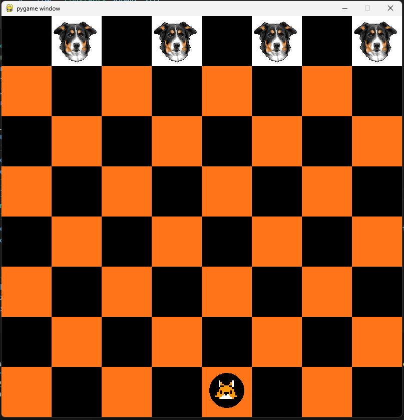

Sure, here's a README for your code:

---

# Checkers Game using Pygame

This is a simple implementation of the game of Checkers using the Pygame library in Python. Checkers is a classic board game played between two players, where each player aims to capture or block the opponent's pieces while avoiding their own pieces being captured.

## Requirements
- Python 3.x
- Pygame

## Installation
You can install Pygame using pip:
```bash
pip install pygame
```

## How to Run
To run the Checkers game, simply execute the Python script `checkers.py` using Python 3.x.



```bash
python checkers.py
```

## Gameplay
- The game initializes with a standard checkers board.
- Red pieces start at the bottom, and white pieces start at the top.
- Players take turns moving their pieces diagonally forward.
- If a piece reaches the opponent's back row, it becomes a king and can move diagonally backward as well.
- Capturing is done by jumping over an opponent's piece diagonally.
- The game ends when one player captures all of the opponent's pieces or blocks them from making any legal moves.

## Code Structure
- `checkers.py` contains the main game loop and initializes the Pygame window.
- `constants.py` defines constants such as colors and board dimensions.
- `board_setup.py` contains the logic for drawing the game board and calculating scores.
- `gameboard.py` contains the class representing the game board and its state.

## Credits
This code is created by Artis Čevers.
